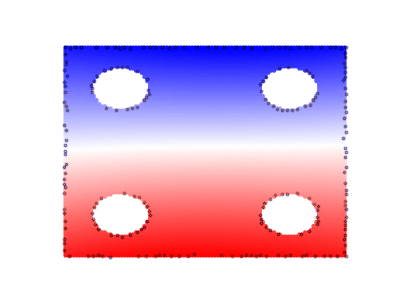

# Progressive Domain Training for Physics-Informed Neural Networks (PINNs)

> This repository contains the official implementation of the experiments from  
> **"A Progressive Domain Decomposition Strategy for Training Physics-Informed Neural Networks"**  
> by Pietro Cestola (2025)

---

## Summary

This project introduces a novel training strategy for **Physics-Informed Neural Networks (PINNs)** that aligns the optimization process with the **natural flow of physical information**. Instead of training the model over the full domain from the start, we propose a **progressive domain decomposition** approach, where the training region grows over time from boundary-constrained regions to the interior.

---

## Motivation

Traditional PINN training does not reflect the causal structure of the physical system. By **exploiting the directional propagation of information**, our method improves:

- convergence speed
- computational efficiency
- solution accuracy

---

## Key Features

- Progressive domain expansion using **geodesic distance partitioning**
- Compatible with irregular and multi-hole 2D geometrie

---

## Examples

<table>
  <tr>
    <td align="center">
      <b>Wave 1D</b> 
      Symmetric propagation of a Gaussian pulse over time. 
      
    </td>
    <td align="center">
      <b>Poisson 2D – C</b> 
      Rectangular domain with four circular holes. 
      
    </td>
    <td align="center">
      <b>Poisson 2D – CG</b> 
      Irregular domain with oscillatory source term and inclusions. 
      
    </td>
  </tr>
</table>

---
